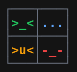
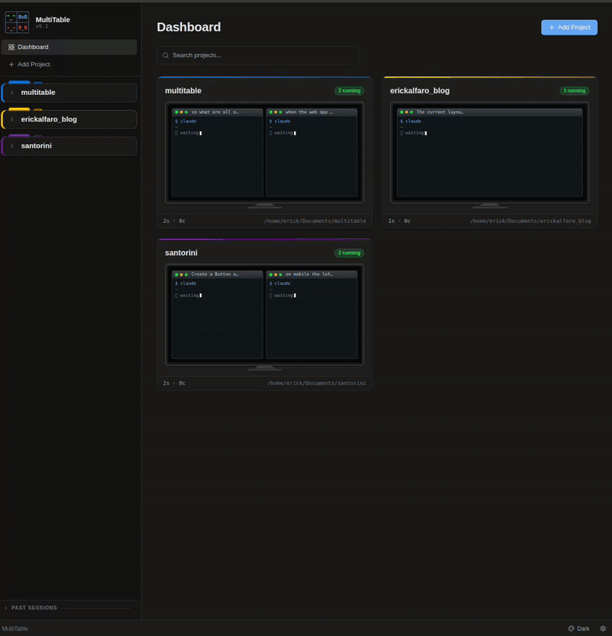
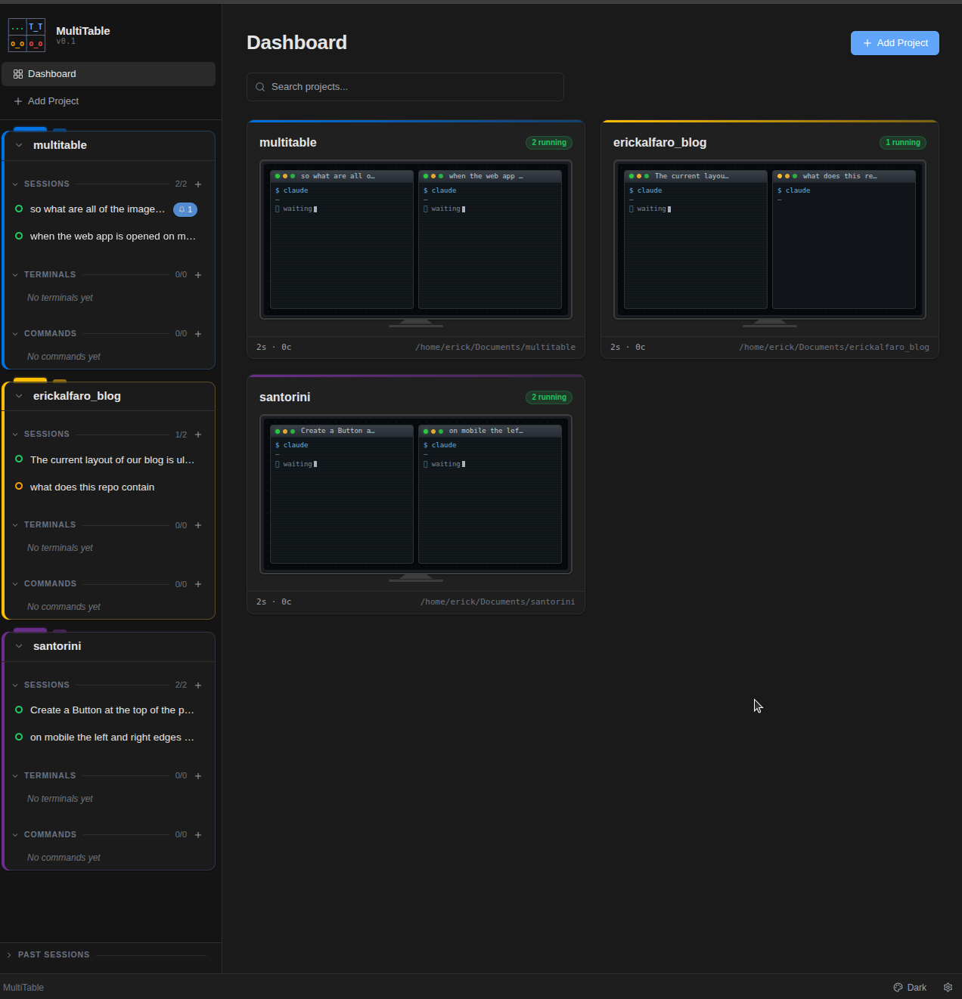
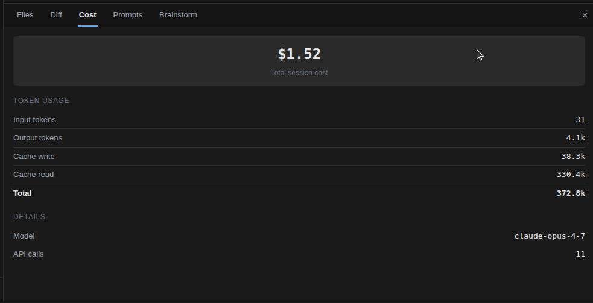
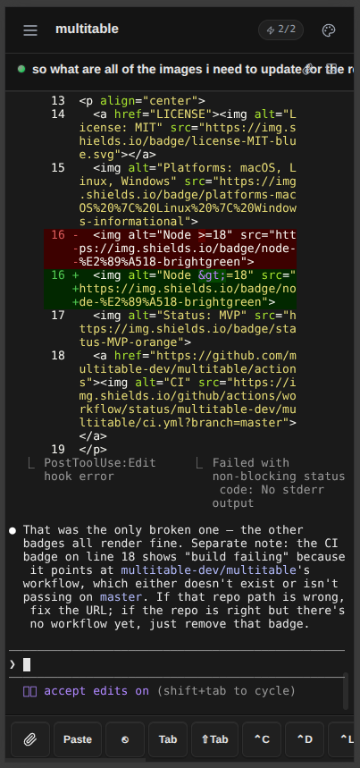
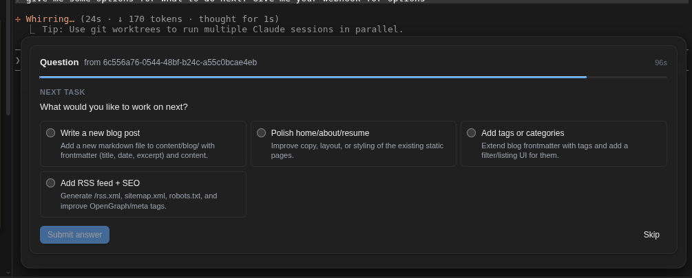
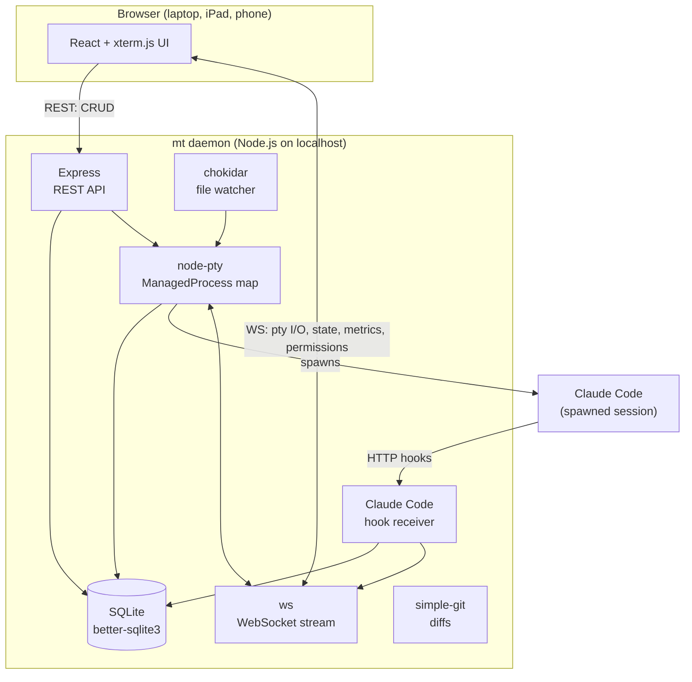

<p align="center">
  <!-- Drop a logo at docs/images/logo.png (512x512 PNG recommended). -->
  
</p>

<h1 align="center">MultiTable</h1>

<p align="center">
  <em>One cockpit for every AI coding agent, dev server, and terminal in your workflow.</em><br/>
  <sub>Because <code>tmux</code> wasn't built for the day Claude, Codex, Aider, and <code>npm run dev</code> all need your attention at once.</sub>
</p>

<p align="center">
  <a href="LICENSE"></a>
  
  
  
  
  <a href="https://github.com/erickalfaro/multitable/actions"></a>
</p>

<p align="center">
  <!-- Record a 15–30s screen cap with asciinema or kap, save as docs/images/demo.gif -->
  
</p>

---

## What is this?

MultiTable is a **local, browser-based dashboard** for the chaos of agentic coding. A small Node.js daemon on your machine spawns your processes via real PTYs (thanks, [`node-pty`](https://github.com/microsoft/node-pty)), persists state in SQLite, and serves a React UI at `http://localhost:3000`. One tab. Every project. Every agent. Every dev server.

It's **agent-agnostic** — Claude Code, Codex, Aider, Cursor's CLI, your own scripts. Anything you'd run in a terminal runs in MultiTable. Claude Code gets first-class hooks integration (in-UI permission prompts, cost tracking, "done" notifications), but nothing about the rest of the app cares which model is on the other end of the PTY.

**Privacy:** the daemon runs entirely on your machine. No accounts, no telemetry, no outbound calls. The only network traffic is between your browser and `localhost` (or your tailnet, if you turn that on).

```
Before MultiTable                      After MultiTable
┌──────┐ ┌──────┐ ┌──────┐             ┌──────────────────────────────┐
│Claude│ │ Codex│ │ npm  │             │  MultiTable (one tab)        │
│ Code │ │      │ │ dev  │             │                              │
└──────┘ └──────┘ └──────┘             │  All processes. One view.    │
┌──────┐ ┌──────┐ ┌──────┐             │  Status at a glance.         │
│Queue │ │ Logs │ │ bash │             │  Auto-restart on crash.      │
│worker│ │      │ │      │             │  Approve perms in the UI.    │
└──────┘ └──────┘ └──────┘             └──────────────────────────────┘
 6+ scattered terminals                  1 tab, everything managed
```

## Why you might want it

- You run **more than one coding agent** at a time (Claude Code + Codex + Aider...) and lose track of which terminal is which.
- Your Claude Code session throws a **permission prompt** while you're on another tab and the run stalls for 30 minutes.
- Your **dev server crashes**, silently, inside one of twelve tmux panes.
- You want to check on a running agent from your **iPad in the kitchen** over Tailscale.
- You want **cost and token usage** per session without scraping logs.

## Why I built this

I wanted to vibe-code from my phone.

Not "SSH into a box and squint at vim" — Termux has done that for years and it's miserable. I wanted the real thing: a proper file explorer, real terminals, status at a glance for every running agent and dev server, and the ability to approve a Claude Code permission prompt from the couch without losing context. I wanted to kick off half a dozen experiments across different repos in the morning and check on each one between meetings.

Nothing existed that did all that, so I built MultiTable.

## Code from anywhere

The daemon runs on your dev machine. The UI runs in any browser. Stretch one over [Tailscale](https://tailscale.com) and your dev environment goes wherever you do — phone on the train, iPad on the couch, borrowed laptop at a coffee shop. Same projects, same agents, same scrollback, same git diffs. You can kick off a Claude Code session from your desktop, leave the house, approve its permission prompts from your phone, and read the diff it produced on your iPad while you make dinner.

Nothing leaves your machine. Tailscale handles the encrypted tunnel; MultiTable just listens on a port. No cloud sync, no relay server, no account.

```yaml
# ~/.config/multitable/config.yml
host: 0.0.0.0   # bind to your tailnet, not the public internet
```

Then open `http://<your-tailscale-hostname>:3000` from any device on the tailnet. That's it.

## Features

- **One sidebar, every process.** Sessions (AI agents), commands (dev servers, workers), and terminals (ad‑hoc shells) in a single tree, grouped by project.
- **Permission prompts surface in the UI.** No more missed Claude Code "Allow / Deny / Always Allow" prompts buried in a pane — accept from any device on your tailnet.
- **Browser notifications + sound chimes** when an agent finishes, needs attention, or asks a permission question. Walk away, hear when it's your turn.
- **Auto-restart with backoff.** Configurable `autorestartMax`, `autorestartDelayMs`, and windowed reset — crashes don't mean silence.
- **File-watch restart** for dev servers — edit `src/**/*.ts`, the watcher restarts the right process.
- **Cost & token tracking** per Claude Code session, parsed from hook events.
- **Git diffs** per session, via `simple-git`, so you can see what an agent actually changed.
- **Session resume.** A Claude Code session remembers its `claudeSessionId`, and on daemon startup you decide whether to resume or start fresh.
- **Command palette** (`cmdk`) for fuzzy-jumping between projects, processes, and actions.
- **SQLite persistence.** Projects, sessions, commands, scrollback — all survive restarts.
- **LAN / Tailscale / mobile.** Bind the daemon to `0.0.0.0`, open the UI from your phone or iPad — same dashboard, with a touch toolbar.
- **Themeable.** Built-in light/dark themes plus user-defined themes via CSS variables.
- **Config-as-code.** Drop an `mt.yml` in a project and everything autostarts the way you described.

## How it compares

|                       | tmux / zellij | Warp / Wave | **MultiTable** |
|-----------------------|---------------|-------------|----------------|
| Multiple PTYs         | ✅            | ✅          | ✅             |
| Survives reboot       | ⚠️ session files | ❌       | ✅ SQLite     |
| Per-process auto-restart | ❌         | ❌          | ✅             |
| File-watch restart    | ❌            | ❌          | ✅             |
| Agent permission prompts in UI | ❌   | ❌          | ✅ (Claude Code) |
| Cost / token tracking | ❌            | ❌          | ✅ (Claude Code) |
| Git diff per session  | ❌            | ❌          | ✅             |
| Use from your phone   | ❌            | ❌          | ✅             |
| 100% local, no account | ✅           | ❌          | ✅             |

## "Isn't this just OpenClaw?"

No — different tool, different problem. The two are genuinely complementary.

[OpenClaw](https://github.com/openclaw/openclaw) is a personal AI agent you talk to through messaging apps (WhatsApp, Telegram, Slack…) that runs skills on your behalf. One of its many skills can delegate work to Claude Code or Codex.

MultiTable is the cockpit for those coding agents. You're watching the actual PTY, scrubbing the scrollback, approving the permission prompts in-line, reading the git diff per session. OpenClaw dispatches work to an agent; MultiTable lets you sit in front of the agent and steer it.

Use OpenClaw when you want to message an assistant from your phone and have it go do things. Use MultiTable when you want to *be* the operator — see every running session, every prompt, every line of output — just from a browser instead of a wall of terminals. There's no reason you can't run both.

A few deliberate scope choices that follow from this framing:

- **Localhost-only by default** (`127.0.0.1`). LAN / Tailscale access is one config line away, but the default is not a public bind.
- **No plugin or skill registry.** MultiTable runs the processes you explicitly spawn. There's no marketplace of community code that auto-loads into your daemon.
- **Coding-loop only.** No messaging bridges, no smart-home control, no general-purpose skill catalog. Every screen is built around dev-loop primitives: sessions, dev servers, terminals, diffs.

## Screenshots

> 📸 Drop screenshots into `docs/images/` and these will render.

| Dashboard | Session detail |
|---|---|
|  |  |

| Terminal view | Permission request |
|---|---|
|  |  |

<details>
<summary>ASCII preview (for repo readers without images)</summary>

```
┌──────────────┬───────────────────────────────────────────────┐
│  SIDEBAR     │  MAIN PANE                                    │
│              │                                               │
│  my-project  │  $ claude                                     │
│   SESSIONS   │  > I'll help you refactor the API...          │
│   ● Claude   │  Reading src/api/routes.ts...                 │
│   ● Codex    │  █                                            │
│   TERMINALS  │                                               │
│   ● Term 1   │  ┌─ Permission Request ─────────────────┐     │
│   COMMANDS   │  │ Claude Code wants to use: Edit       │     │
│   ● npm:dev  │  │ File: src/api/routes.ts              │     │
│   ● Queue    │  │ [Allow]  [Deny]  [Always Allow]      │     │
│              │  └──────────────────────────────────────┘     │
├──────────────┴───────────────────────────────────────────────┤
│ [Focus][Pause][Clear][Stop][Restart]   CPU 2.1%  MEM 43MB   │
└──────────────────────────────────────────────────────────────┘
```

</details>

---

## Installation

MultiTable is pre-npm-publish — you install it from source. All three platforms follow the same three-step dance:

1. **Install prerequisites** (Node + build tools for native modules).
2. **Clone + install + build**.
3. **Link the `mt` CLI** so you can run `mt start` from anywhere.

### Prerequisites (all platforms)

- **Node.js ≥ 18** — <https://nodejs.org/> (LTS is fine)
- **npm ≥ 9** (ships with Node 18+)
- **Git**

> **Why native build tools?** MultiTable depends on `better-sqlite3` and `node-pty`, which are native C/C++ modules. `npm install` will attempt to download prebuilt binaries; if none exist for your platform/Node version, it falls back to building from source and will need a compiler.

### 🍎 macOS

```bash
# 1. Install Xcode Command Line Tools (for native module builds)
xcode-select --install

# 2. Clone, install, build
git clone https://github.com/erickalfaro/multitable.git
cd multitable
npm install
npm run build

# 3. Make `mt` available globally
cd packages/cli && npm link && cd ../..
```

### 🐧 Linux (Debian / Ubuntu)

```bash
# 1. Install build tools
sudo apt-get update
sudo apt-get install -y build-essential python3 git

# 2. Clone, install, build
git clone https://github.com/erickalfaro/multitable.git
cd multitable
npm install
npm run build

# 3. Make `mt` available globally
cd packages/cli && sudo npm link && cd ../..
```

On **Fedora / RHEL**: replace step 1 with `sudo dnf install -y gcc-c++ make python3 git`.
On **Arch**: `sudo pacman -S --needed base-devel python git`.

### 🪟 Windows 10 / 11

**Use PowerShell, not `cmd.exe`.** A few of the npm scripts rely on Unix-ish shell idioms (`cp`), which PowerShell aliases but `cmd.exe` does not.

```powershell
# 1. When installing Node from nodejs.org, check the box:
#    "Automatically install the necessary tools for native modules"
#    (That pulls Visual Studio Build Tools + Python 3 via Chocolatey.)

# 2. Clone, install, build
git clone https://github.com/erickalfaro/multitable.git
cd multitable
npm install
npm run build

# 3. Make `mt` available globally
cd packages\cli
npm link
cd ..\..
```

> **Known Windows limitation:** per-process CPU % shows as `0` on Windows (the metrics poller uses Unix `ps` as a fallback). Memory and state work normally. PR welcome.

### Uninstall

```bash
cd multitable/packages/cli && npm unlink -g
cd ../.. && rm -rf node_modules
rm -rf ~/.config/multitable       # config
rm -rf ~/.local/share/multitable  # SQLite db, scrollback (Linux/macOS path)
```

---

## Quick start

```bash
mt start          # start the daemon on http://localhost:3000
mt open           # open the UI in your browser
```

…or skip the CLI and run dev mode (daemon + Vite with HMR):

```bash
npm run dev
# Daemon:      http://127.0.0.1:3000
# Vite dev UI: http://127.0.0.1:5173  (proxies /api and /ws to the daemon)
```

From the empty dashboard:

1. Click **+ Add Project** → point it at any directory on disk.
2. Add a session (`claude`, `codex`, `aider`, whatever your agent is) or a command (`npm run dev`).
3. Hit **Start**.
4. Grab a drink.

## Configure a project with `mt.yml`

Drop this at the root of any project and MultiTable will pick it up on startup:

```yaml
name: my-project
sessions:
  - name: Claude Code
    command: claude
    autostart: true
commands:
  - name: npm:dev
    command: npm run dev
    autostart: true
    fileWatchPatterns:
      - "src/**/*.ts"
  - name: Queue
    command: php artisan queue:work
    autostart: true
    autorestart: true
    autorestartMax: 5
    autorestartDelayMs: 2000
```

## Global daemon config

`~/.config/multitable/config.yml` (Linux/macOS) — or the equivalent on Windows via [`env-paths`](https://github.com/sindresorhus/env-paths):

```yaml
port: 3000
host: 127.0.0.1   # change to 0.0.0.0 to accept LAN / Tailscale connections
```

## Remote access setup

See [Code from anywhere](#code-from-anywhere) above for the why. The full recipe:

1. Install [Tailscale](https://tailscale.com) on your dev machine and on every device you want to reach it from. Sign in to the same tailnet on each.
2. Set `host: 0.0.0.0` in `~/.config/multitable/config.yml` and restart the daemon.
3. Find your dev machine's tailnet name (`tailscale status` shows it) and open `http://<tailscale-hostname>:3000` from any device on the tailnet.

A few things worth noting:

- **Don't bind to `0.0.0.0` without Tailscale** unless you know what you're doing. The daemon has no auth — anything on your network can reach it.
- **Mobile UI is responsive** — there's a touch toolbar and a swipe-out sidebar built specifically for phone-sized screens.
- **WebSocket reconnects automatically** when you switch networks (Wi-Fi → cellular and back), so you can walk out the door mid-session.

---

## Architecture



See [`docs/SPEC.md`](docs/SPEC.md) for the full product specification and [`docs/OVERVIEW.md`](docs/OVERVIEW.md) for a deeper visual walkthrough.

## Repository layout

```
packages/
  daemon/   Node.js backend — Express + ws + node-pty + SQLite
  web/      React frontend — xterm.js + Zustand + Tailwind
  cli/      `mt` command (commander)
docs/       Product spec and overview diagrams
```

## Roadmap

- [x] **v0.1** Foundation — daemon + React + single terminal + projects
- [x] **v0.2** Persistence — SQLite + dashboard + status indicators
- [x] **v0.3** Git tools — diff viewer per session
- [x] **v0.4** Claude Code integration — hooks, in-UI permissions, options, resume, cost & token tracking
- [ ] **v0.5** Global keyboard shortcuts (`Ctrl+K` palette, process jumps) and richer search
- [ ] **v0.6** Polish — conflict detection improvements, CLI ergonomics, more themes, packaged binaries

## Contributing

Contributions of all sizes welcome — bug reports, docs fixes, entire features. See [`CONTRIBUTING.md`](CONTRIBUTING.md).

Good first issues are labelled `good first issue`. The most useful early PRs would be:

- **Global keyboard shortcuts** (the command palette opens, but nothing has bound `Ctrl+K` yet).
- **Windows per-process CPU %** (the metrics poller currently relies on Unix `ps`).
- **Adapters for additional agents** beyond Claude Code (Codex, Aider, etc. work as raw PTYs today; deeper hook-style integration is wide open).

## Security

Please **don't open public issues** for vulnerabilities. See [`SECURITY.md`](SECURITY.md).

## License

MIT — see [`LICENSE`](LICENSE).

---

<p align="center"><sub>Built with node-pty, React, SQLite, and a healthy refusal to tmux one more thing.</sub></p>
